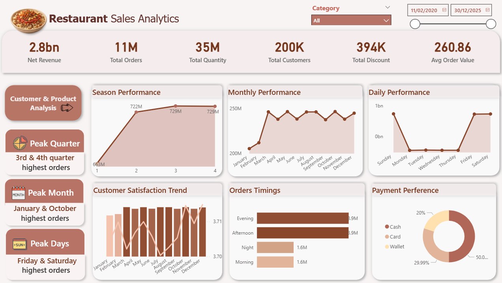
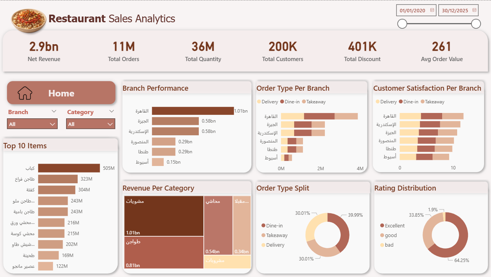

# 🍽️ Restaurant Sales Analytics

## Project Overview

This project presents a **Restaurant Sales Analytics Dashboard** built using **Databricks, SQL, and Power BI** to analyze restaurant operations, customer behavior, and business performance.

The goal of this project is to transform **raw restaurant transaction data** into **actionable business insights** through data transformation, and interactive dashboards.

This dashboard helps answer key business questions:

* Which branch performs best?
* What are the most popular items?
* When do customers order the most?
* How satisfied are customers?
* What payment methods are preferred?

---

# Dashboard Preview

## Sales Overview Dashboard

<!-- ضع صورة الداشبورد الأولى هنا -->

## Customer & Product Analysis Dashboard

<!-- ضع صورة الداشبورد الثانية هنا -->

---

#  Dashboard Features

## Sales Overview

### KPIs

* Net Revenue
* Total Orders
* Total Quantity
* Total Customers
* Total Discount
* Average Order Value

### Visualizations

* Branch Performance
* Order Type Per Branch
* Customer Satisfaction Per Branch
* Top 10 Items
* Revenue Per Category
* Order Type Split
* Rating Distribution

---

## Customer & Product Analysis

### Visualizations

* Season Performance
* Monthly Performance
* Daily Performance
* Customer Satisfaction Trend
* Orders Timing
* Payment Preference

---

# Key Insights

* Cairo branch generates the highest revenue
* Peak months: January & October
* Peak days: Friday & Saturday
* Evening & Afternoon are peak ordering times
* Cash is the most preferred payment method
* Majority of customers rated Excellent

---

# Tools & Technologies

* Databricks
* SQL
* Delta Lake
* Power BI
* Data Modeling
* Data Visualization

---

# 🎯 Business Value

This dashboard helps:

* Improve sales performance
* Understand customer behavior
* Optimize operations
* Increase profitability
